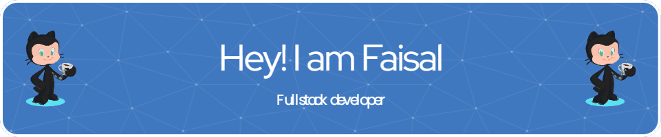

<h1> Hi 👨🏻‍💻 Respected Viewer 👋 </h1>

  

<h2>Full Stack Web Developer</h2>

I am a highly skilled Full-Stack software engineer, driven by a passion for Rails and armed with a versatile skillset. With expertise in JavaScript, Ruby, Rails, React, and Redux <strong>Available for Hire</strong> I am entrepreneur, and branding specialist with a successful track record in developing and co-founding technology startups. With a strong leadership acumen, I thrive on tackling complex problems, generating innovative ideas, conceptualizing solutions, and delivering technology-driven products that cater to consumer needs. Over the past few months, I have adeptly managed remote and asynchronous work environments, employing pair programming methodologies to collaborate with individuals from diverse cultural backgrounds and spearhead the development of impactful real-world projects. With a solid educational foundation in Computer Science, I possess comprehensive proficiency across all layers of the software development stack. If you have time, I'd love to chat with you for 10 minutes.
and looking forward to help you and take your business to the next level.

- 🌱 I’m currently learning **Full stack development at Microverse**
- 👨‍💻 All of my projects are available at [https://github.com/faisalakb](https://github.com/faisalakb)
- 📫 How to reach me **faisalakb786@gmail.com**

<h3 align="left">Connect with me:</h3>

<h2 style="color: #44AEFB">⚙️ Languages and Tools</h2>

           

<h2 style="color: #44AEFB">📊 Statistics</h2>

<!--  -->

<!-- Begin Stats Cards -->
<!-- Resources:  -->
<!-- Github & Languages Stats: https://github.com/anuraghazra/github-readme-stats --> 
<!-- Streak Stats: https://github.com/denvercoder1/github-readme-streak-stats -->
<!-- Change the value after ?username= to your GitHub username. -->

 

